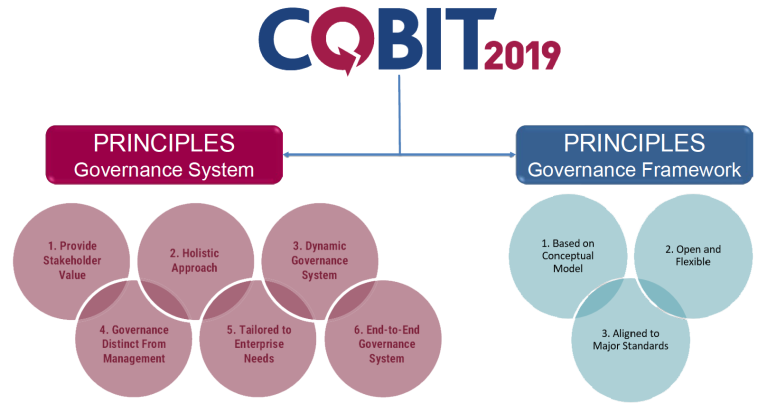

- [COBIT](#cobit)
- [COBIT 2019](#cobit-2019)
  - [Is COBIT compleet?](#is-cobit-compleet)
- [Bronnen](#bronnen)

```
[X] Wat dit nu voor standasard/framework is.
[ ] Hoe dit bijdraagt aan de governance van cloud processen, componenten, services, business en de mensen die ermee werken.
[X] Is het compleet, dat wil zeggen: Worden alle aspecten die met Governance te maken hebben afgedekt?
[ ] Wat zijn de sterke punten en wat is minder goed?
[ ] Wat doen de grote public cloud providers eigenlijk met deze standaard/framework? 
    [ ] Conformeren zij zich hieraan?
```
# COBIT
COBIT (Control Objectives for Information and Related Technologies) een framework dat door ISACA (Information Systems Audit and Control Association) is ontwikkeld in 1992. In een Executive summary van ISACA omschrijven zij COBIT alsvolgt:
 -  Een framework voor governance en management van enterprise I&T.
 -  COBIT defineert de componenten om een governance systeem te bouwen en onderhouden.
 -  COBIT defineert de ontwerpfactoren die door de onderneming moeten worden overwogen om een passend governance systeem te bouwen.
 -  COBIT is flexibel en staat open om nieuwe onderwerpen toe te voegen.

Dat COBIT flexibel is is te merken doordat ze regelmatig updaten en hierbij kijken naar andere frameworks. De huidige versie is COBIT 2019. In COBIT 2019 zijn er zes principes in COBIT 5 de vorige versie zijn dat er vijf daarnaast zijn er een aantal onderwerpen toegevoegd. COBIT 5 was de grootste veranderingg die ISACA aan COBIT had doorgevoerd. Hierdoor is COBIT 5 ook vandaag de dag nog erg populair.

# COBIT 2019
COBIT is zoals eerder benoemd de meest recente versie van COBIT. Er zijn zes "governance system principles" en drie "governance framework principles".



Figuur 1


Naast deze principes zijn er beheer en management doelen, die zijn te zien in Figuur 2. Onder deze doelen zijn 40 processen onderkent. Opvallend hierbij is dat er onderscheid is tussen Governance (beheer) en Management. Vaak lopen deze verantwoordelijkheden door elkaar. COBIT maakt dit onderscheid alsvolgt: 
- De governance objectives zorgen ervoor dat Stakeholder eisen en wensen worden geëvalueerd en overeenkomen met de doelen van de onderneming.
- De management objectives; plannen, bouwen, voeren uit, en monitoren of alles overeenkomt met de governance objectives.


Figuur 2

Zoals eerder benoemd zijn er 40 processen die vallen onder de bovenstaande objectives. Deze processen zijn allemaal volledig omschreven en opgenomen in het COBIT 2019 Governance System Design Workbook. In de onderstaande video omschrijft Mark Thomas hoe dit werkboek precies werkt. Hierin kan je zien dat het een soort tool is waarmee COBIT je ondersteunt in het creëen van een beleid dat nadruk legt op wat belangrijk is in jouw onderneming.

[](https://www.youtube.com/watch?v=AttJcpMGQzI)


ICASA biedt ook een compleet RACI overzicht (COBIT 2019_RACI by role_April 2020) die toepasbaar zijn op de eerder benoemde 40 processen. Hieronder is het tabel te zien waar de "Board" bijvoorbeeld "accountable" voor is:

| Count of Board      |           |             |                                                             |       |
|---------------------|-----------|-------------|-------------------------------------------------------------|-------|
| Board               | Objective | Practice ID | Practice_Name                                               | Total |
| Accountable         | EDM01     | EDM01.01    | Evaluate the governance system.                             | 1     |
|                     |           | EDM01.02    | Direct the governance system.                               | 1     |
|                     |           | EDM01.03    | Monitor the governance system.                              | 1     |
|                     | EDM02     | EDM02.01    | Establish the target investment mix.                        | 1     |
|                     |           | EDM02.02    | Evaluate value optimization.                                | 1     |
|                     |           | EDM02.03    | Direct value optimization.                                  | 1     |
|                     |           | EDM02.04    | Monitor value optimization.                                 | 1     |
|                     | EDM03     | EDM03.01    | Evaluate risk management.                                   | 1     |
|                     |           | EDM03.02    | Direct risk management.                                     | 1     |
|                     |           | EDM03.03    | Monitor risk management.                                    | 1     |
|                     | EDM04     | EDM04.01    | Evaluate resource management.                               | 1     |
|                     |           | EDM04.02    | Direct resource management.                                 | 1     |
|                     |           | EDM04.03    | Monitor resource management.                                | 1     |
|                     | EDM05     | EDM05.01    | Evaluate stakeholder engagement and reporting requirements. | 1     |
|                     |           | EDM05.02    | Direct stakeholder engagement, communication and reporting. | 1     |
|                     |           | EDM05.03    | Monitor stakeholder engagement.                             | 1     |
| Accountable   Total |           |             |                                                             | 16    |
| Grand   Total       |           |             |                                                             | 16    |

Als objective is te zien dat het zoals in figuur 2 allemaal "Governance objectives" zijn


## Is COBIT compleet?

Op basis van de informatie en bronnen die in dit document zijn behandelt is te zien dat COBIT een compleet framework is die veel ondersteuning biedt in de keuzes die een onderneming moet maken. COBIT Zorgt ervoor dat de ondermening deze keuzes wel echt zelf maakt.

Wat COBIT niet doet is technolgie behandelen dus wanneer je kijkt naar bijvoorbeeld AWS of Microsift Azure die nemen in hun framework ook cloud techniek mee. COBIT laat dit in het midden liggen ze bieden wel ondersteuning voor cloud en het is ook toepasbaar op in de cloud. Maar dat komt omdat ze nadruk leggen op het creëeren van waarde met de technologie waarover een onderneming beschikt.


# Bronnen
https://www.house-of-control.nl/cobit-5.html

https://www.youtube.com/watch?v=AttJcpMGQzI

COBIT 2019_RACI by role_April 2020

COBIT 2019 Executive Summary_v1.1 

COBIT 2019 Overview_v1.1.pdf

Afbeeldingen uit:
COBIT 2019 Overview_v1.1.pdf
