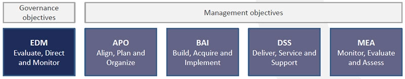

# Week 6 Les 1: Governance Frameworks
## COBIT Framework

[https://github.com/CasualMit/cloudgov](https://github.com/CasualMit/cloudgov)

Hogeschool Utrecht
DU3A
Mitchell Huitema 1758032
Sherwin Kooij 

- [Week 6 Les 1: Governance Frameworks](#week-6-les-1-governance-frameworks)
  - [COBIT Framework](#cobit-framework)
- [COBIT](#cobit)
- [COBIT 2019](#cobit-2019)
  - [Is COBIT compleet?](#is-cobit-compleet)
  - [Wat doen de grote public cloud providers eigenlijk met deze standaard/framework?](#wat-doen-de-grote-public-cloud-providers-eigenlijk-met-deze-standaardframework)
  - [Kracht en Zwakte van COBIT](#kracht-en-zwakte-van-cobit)
- [Bronnen](#bronnen)

# COBIT
COBIT (Control Objectives for Information and Related Technologies) een framework dat door ISACA (Information Systems Audit and Control Association) is ontwikkeld in 1992. In een [Executive summary](COBIT%202019%20Executive%20Summary_v1.1%20.pdf) van ISACA omschrijven zij COBIT als volgt:
 -  Een framework voor governance en management van enterprise I&T.
 -  COBIT definieert de componenten om een governance systeem te bouwen en onderhouden.
 -  COBIT definieert de ontwerpfactoren die door de onderneming moeten worden overwogen om een passend governance systeem te bouwen.
 -  COBIT is flexibel en staat open om nieuwe onderwerpen toe te voegen.

Vervolgens specificeren  zij ook dat COBIT vooral niet het volgende is:
- Een volledige beschrijving van de gehele IT omgeving van een onderneming
- Een framework om bedrijfsprocessen te organiseren.
- Een (IT-) technisch framework om alle technologie te managen.
- COBIT schrijft geen IT keuzes voor, en maakt deze keuzes ook niet.

COBIT is flexibel dat is te merken doordat ze regelmatig updaten en hierbij kijken naar andere frameworks en open staan voor input van buitenaf. De huidige versie is COBIT 2019. In COBIT 2019 zijn er zes principes, in COBIT 5 de vorige versie zijn dat er vijf. COBIT 5 was de grootste verandering die ISACA aan COBIT had doorgevoerd. Hierdoor is COBIT 5 ook vandaag de dag nog erg populair. Het verschil tussen COBIT 5 en COBIT 2019 is niet heel groot. Op de volgende pagina wordt het volledig uitgelegd. het is namelijk wel van belang te weten dat er twee versies worden gebruikt en dat de terminologie minimaal verschilt. [Cobit 5 vs Cobit 2019](https://www.isaca.org/resources/news-and-trends/industry-news/2020/cobit-2019-and-cobit-5-comparison)

|                                                          COBIT 5                                                          |               COBIT 2019                                                                                                     |
|:-------------------------------------------------------------------------------------------------------------------------:|:----------------------------------------------------------------------------------------------------------------------------:|
|               Five governance principles                                                                                  |               Six governance principles                                                                                      |
|               37 processes                                                                                                |               40 processes                                                                                                   |
|               “Manage” terminology is used for management processes “Ensure” terminology is used for governance processes |               “Managed” terminology is used for management processes  “Ensured” terminology is used for governance processes |
|               Governance framework principles are absent                                                                  |               Governance framework principles area added                                                                     |
|               Measuring performance uses 0-5 scale based on ISO/IEC 33000                                                 |               CMMI performance management scheme used                                                                        |
|               Enablers are included                                                                                       |               Enablers are renamed as components                                                                             |
|               Design factors are not available                                                                            |               Design factors are included                                                                                    |

# COBIT 2019
COBIT is zoals eerder benoemd de meest recente versie van COBIT. Er zijn zes "governance system principles" en drie "governance framework principles". ISACA heeft [pdf](COBIT%202019%20Overview_v1.1.pdf) waarin COBIT 2019 globaal wordt uitgelegd.

Figuur 1 COBIT 2019 Principles

Naast deze principes zijn er beheer en management doelen, die zijn te zien in Figuur 2. Onder deze doelen zijn 40 objectives onderkent. Opvallend hierbij is dat er onderscheid is tussen Governance (beheer) en Management. Vaak lopen deze verantwoordelijkheden door elkaar. COBIT maakt dit onderscheid als volgt: 
- De governance objectives zorgen ervoor dat Stakeholder eisen en wensen worden geëvalueerd en overeenkomen met de doelen van de onderneming.
- De management objectives; plannen, bouwen, voeren uit, en monitoren of alles overeenkomt met de governance objectives.

Figuur 2 COBIT Objectives
Zoals eerder benoemd zijn er 40 objectives die vallen onder de bovenstaande objectives. Deze processen zijn allemaal volledig omschreven en opgenomen in het COBIT 2019 Governance System Design Workbook. In de onderstaande video omschrijft Mark Thomas hoe dit werkboek precies werkt. Hierin kan je zien dat het een soort tool is waarmee COBIT je ondersteunt in het creëren  van een beleid dat nadruk legt op wat belangrijk is in jouw onderneming.

ICASA biedt ook een compleet RACI overzicht (COBIT 2019_RACI by role_April 2020) die toepasbaar zijn op de eerder benoemde 40 processen. Hieronder is het tabel te zien voor welke processen de "Board" accountable voor is:

| Count of Board      |           |             |                                                             |
|---------------------|-----------|-------------|-------------------------------------------------------------|
| Board               | Objective | Practice ID | Practice_Name                                               |
| Accountable         | EDM01     | EDM01.01    | Evaluate the governance system.                             |
|                     |           | EDM01.02    | Direct the governance system.                               |
|                     |           | EDM01.03    | Monitor the governance system.                              |
|                     | EDM02     | EDM02.01    | Establish the target investment mix.                        |
|                     |           | EDM02.02    | Evaluate value optimization.                                |
|                     |           | EDM02.03    | Direct value optimization.                                  |
|                     |           | EDM02.04    | Monitor value optimization.                                 |
|                     | EDM03     | EDM03.01    | Evaluate risk management.                                   |
|                     |           | EDM03.02    | Direct risk management.                                     |
|                     |           | EDM03.03    | Monitor risk management.                                    |
|                     | EDM04     | EDM04.01    | Evaluate resource management.                               |
|                     |           | EDM04.02    | Direct resource management.                                 |
|                     |           | EDM04.03    | Monitor resource management.                                |
|                     | EDM05     | EDM05.01    | Evaluate stakeholder engagement and reporting requirements. |
|                     |           | EDM05.02    | Direct stakeholder engagement, communication and reporting. |
|                     |           | EDM05.03    | Monitor stakeholder engagement.                             |

Als objective is te zien dat het zoals in figuur 2 allemaal "Governance objectives" zijn. In het volledige RACI overzicht is dan ook duidelijk te zien welke functies er binnen een bedrijf verantwoordelijk  kunnen zijn voor het correct implementeren van het beleid binnen de onderneming.

## Is COBIT compleet?
Op basis van de informatie en bronnen die in dit document zijn behandelt is te zien dat COBIT een compleet framework is die veel ondersteuning biedt in de keuzes die een onderneming moet maken. COBIT Zorgt ervoor dat de onderneming  deze keuzes wel echt zelf maakt en niet verteld hoe zij dit moeten doen. Wat COBIT niet doet is technologie behandelen dus wanneer je kijkt naar bijvoorbeeld AWS of Microsoft Azure die nemen in hun framework ook cloud techniek mee. COBIT laat dit in het midden liggen ze bieden wel ondersteuning voor cloud en het is ook toepasbaar op in de cloud. Maar dat komt omdat ze nadruk leggen op het creëren van waarde met de technologie waarover een onderneming beschikt. Hierdoor wordt er uiteindelijk welk op elk front binnen IT beleid toegepast en zullen 

## Wat doen de grote public cloud providers eigenlijk met deze standaard/framework?
De grote public cloud providers benoemen COBIT vrijwel nergens. Hier en daar is een blog post te vinden of een oud rapport waarin COBIT een enkele keer wordt benoemd. Maar daar wordt de implementatie ervan nooit in uit gewerkt. Vermoedelijk komt dit doordat AWS en Azure hun eigen frameworks hebben ontwikkeld die specialistisch  is naar de cloud. COBIT is dit simpelweg niet het kan er wel heel goed op worden toegepast.

## Kracht en Zwakte van COBIT
COBIT is enorm veelzijdig en geeft veel ruimte om het te vormen naar de eisen en wensen van een onderneming. Het is internationaal bekend en kent veel ondersteuning wereldwijd. Wanneer het volledig is toegepast dan zijn alle vlakken van beleidsvoering  en managen gedekt en ligt de focus bij de lange termijn strategie van de onderneming.

Een nadeel echter is dat het diep in een organisatie moet zitten, het zal daardoor veel tijd en energie kosten om het toe te passen binnen een organisatie. Bijna al het personeel zal moeten worden getraind om COBIT toe te passen en dat zal veel kosten meedragen. Ook zal dit binnen een organisatie kunnen zorgen voor frictie binnen de bedrijfscultuur dat is overigens speculatie en zal een grote verandering in beleidsvoering gepaard gaan met zorgvuldig onderzoek.

# Bronnen

https://www.youtube.com/watch?v=Y8kqh9q3Jwg

https://www.youtube.com/watch?v=AttJcpMGQzI

COBIT 2019_RACI by role_April 2020

COBIT 2019 Executive Summary_v1.1 

COBIT 2019 Overview_v1.1.pdf

Afbeeldingen uit:
COBIT 2019 Overview_v1.1.pdf
