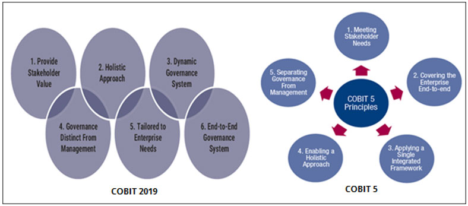

# COBIT

- [COBIT](#cobit)
- [COBIT 2019](#cobit-2019)
  - [Zes principes van COBIT 2019](#zes-principes-van-cobit-2019)
- [Bronnen](#bronnen)

```
[ ] Wat dit nu voor standasard/framework is.
[ ] Hoe dit bijdraagt aan de governance van cloud processen, componenten, services, business en de mensen die ermee werken.
[ ] Is het compleet, dat wil zeggen: Worden alle aspecten die met Governance te maken hebben afgedekt?
[ ] Wat zijn de sterke punten en wat is minder goed?
[ ] Wat doen de grote public cloud providers eigenlijk met deze standaard/framework? 
    [ ] Conformeren zij zich hieraan?
```
# COBIT 2019
COBIT (Control Objectives for Information and Related Technologies) een framework dat door ISACA (Information Systems Audit and Control Association) is ontwikkeld in 1992. De huidige versie is COBIT 2019 echter is COBIT 5 wat in 2012 is uitgebracht nog erg populair. In COBIT 2019 zijn er zes principes in COBIT 5 zijn dat er vijf dat is één van de grote verschillen.



Figuur 1

## Zes principes van COBIT 2019
1. Provide Stakeholder Value
2. Holisitc Approach
3. Dynamic Governance System
4. Governance Distinct From Management
5. Tailored to Enterprise Needs
6. End-to-End Governance System


# Bronnen
https://www.house-of-control.nl/cobit-5.html

https://www.youtube.com/watch?v=AttJcpMGQzI

Figuur 1: https://www.isaca.org/resources/news-and-trends/industry-news/2020/cobit-2019-and-cobit-5-comparison
